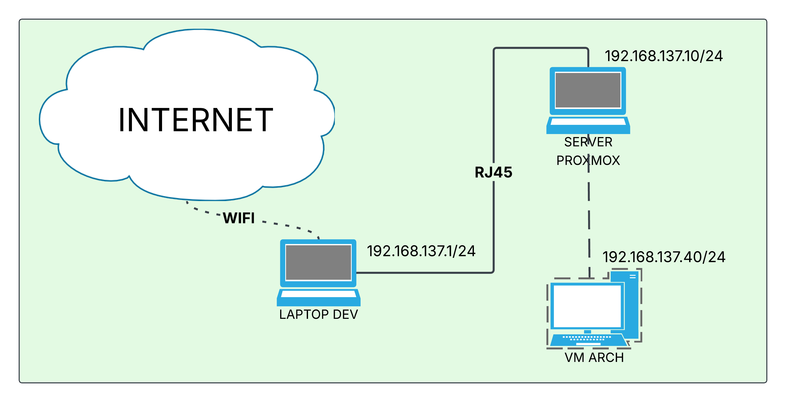
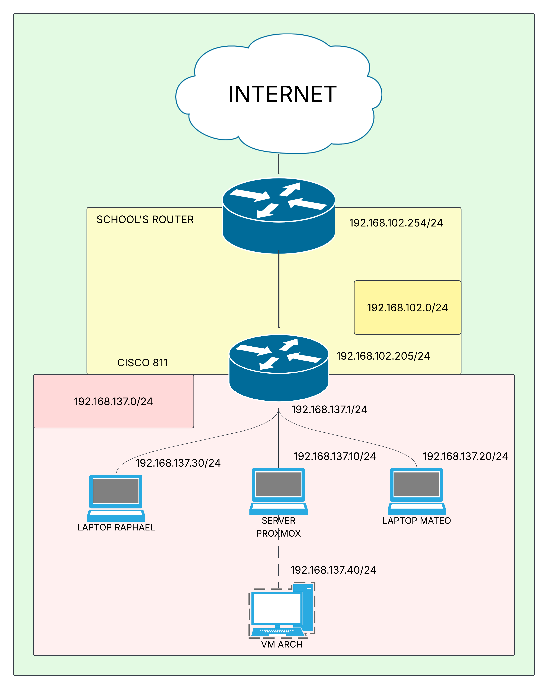

# Infrastructure Setup

This document details the complete infrastructure setup used for the development of the ISIMA Purple Linux System (IPLS). It notably details:
- The network infrastructure
- The router configuration
- The IP addresses mapping
- The configuration of the Proxmox server and its hosted Arch Linux VM.

## Network Infrastructure

The configuration is split into two distinct architectures. The first architecture is designed for standalone work in a student residency where no ethernet connection to the ISP box is available, requiring Wi-Fi sharing. The second architecture is designed for collaborative work at school.

### Home Infrastructure

Below is the home network architecture diagram:



To provide internet access to the Proxmox server without a direct physical link to the residential box, we configured a network connection sharing from the developer laptop's Wi-Fi interface to its Ethernet interface. By default, this assigns the `192.168.137.1/24` gateway address to the laptop's Ethernet interface. 

We assigned the `192.168.137.10/24` IP address to the Proxmox server and the `192.168.137.40/24` IP address to the Arch Linux VM hosted within. 

### School Infrastructure

Below is the school network architecture diagram:



The school provides internet access to the classroom via a main router performing NAT (Network Address Translation) for the `192.168.102.0/24` subnet. We cascaded a Cisco 881 router behind this main router, assigning it the `192.168.102.205/24` IP address on its WAN interface.

To maintain consistency with the home infrastructure, we configured the `192.168.137.1/24` IP address on the Cisco router's `Vlan1` LAN interface, acting as the gateway for the laptops and the server.

Below is the Cisco router configuration used to deploy this setup:

```bash
! 1. Basic configuration of the router
Router> enable
Router# conf terminal
! To avoid DNS resolution when mistyping a command
Router(config)# no ip domain-lookup 
! To avoid Logs to perturb the typing of the commands
Router(config)# line console 0
Router(config)#     logging synchronous
Router(config)#     exit

! 2. WAN Interface (connected to the ISIMA network)
Router(config)# interface FastEthernet4
Router(config-if)# ip address 192.168.102.205 255.255.255.0
Router(config-if)# ip nat outside
Router(config-if)# no shutdown

! 3. LAN Interface (Laptops and Server gateway)
Router(config-if)# interface Vlan1
Router(config-if)# ip address 192.168.137.1 255.255.255.0
Router(config-if)# ip nat inside
Router(config-if)# no shutdown
Router(config-if)# exit

! 4. Default route (route to the ISIMA gateway)
Router(config)# ip route 0.0.0.0 0.0.0.0 192.168.102.254

! 5. Double NAT (mandatory to mask the .137 network to the ISIMA router)
Router(config)# access-list 1 permit 192.168.137.0 0.0.0.255
Router(config)# ip nat inside source list 1 interface FastEthernet4 overload
Router(config)# exit
! 6. Copy the config into the startup-config to ensure persistence
Router# copy running-config startup-config
```

## Laptops Configuration

Static IP addresses are assigned to the developer laptops as follows:

**Mateo's Laptop:**
- **IP          :** 192.168.137.20/24
- **Subnet Mask :** 255.255.255.0
- **Gateway     :** 192.168.137.1
- **DNS         :** 8.8.8.8

**Raphael's Laptop:**
- **IP          :** 192.168.137.30/24
- **Subnet Mask :** 255.255.255.0
- **Gateway     :** 192.168.137.1
- **DNS         :** 8.8.8.8

## Proxmox Server Network Configuration

The Proxmox server uses a Linux bridge configuration. Ensure the `/etc/network/interfaces` file contains the following (adjust the NIC name `enx70198886dd4d` if necessary):

```bash
auto lo
iface lo inet loopback

auto enx70198886dd4d
iface enx70198886dd4d inet manual

auto vmbr0
iface vmbr0 inet static
    address 192.168.137.10/24
    gateway 192.168.137.1
    bridge-ports enx70198886dd4d
    bridge-stp off 
    bridge-fd 0

source /etc/network/interfaces.d/*
```

## Arch VM Network Configuration

The Arch Linux VM utilizes `systemd-networkd` for network management. In the `/etc/systemd/network/20-wired.network` file, ensure the following configuration is set (adjust `ens18` to match your interface name):

```ini
[Match]
Name=ens18

[Network]
Address=192.168.137.40/24
Gateway=192.168.137.1
DNS=1.1.1.1
```

*(Note: If no text editor is installed in your Arch VM during the initial setup, you can create this file using shell redirection:
```bash
cat > /etc/systemd/network/20-wired.network << "EOF"
[Match]
Name=ens18

[Network]
Address=192.168.137.40/24
Gateway=192.168.137.1
DNS=1.1.1.1
EOF
```
)*

Finally, start and enable the network manager and the DNS resolver, and link the DNS resolution file:

```bash
systemctl enable --now systemd-networkd
systemctl enable --now systemd-resolved
ln -sf /run/systemd/resolve/stub-resolv.conf /etc/resolv.conf
```